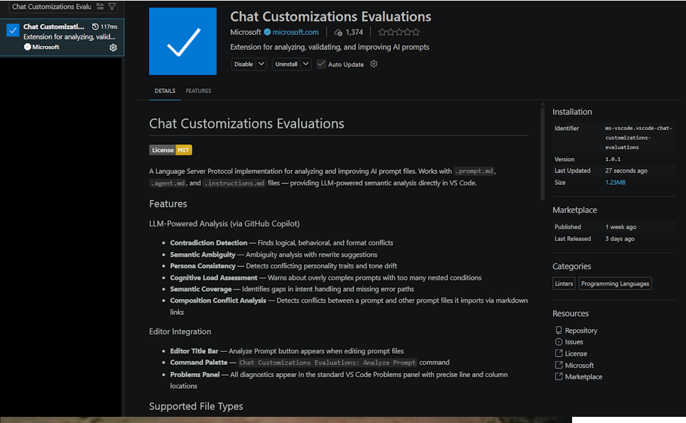

## Product Updates

### Where to find them:

- VS Code Update Log: <a target="_blank" href="https://code.visualstudio.com/updates/">https://code.visualstudio.com/updates/</a>
- Copilot Update Log: <a target="_blank" href="https://github.blog/changelog/label/copilot/">https://github.blog/changelog/label/copilot/</a>
- Copilot CLI Update Log: - <a target="_blank" href="https://code.visualstudio.com/updates/">https://code.visualstudio.com/updates/</a>

---
### Notable Changes in v1.119 - May 5, 2026
    Enabled markdown view - Shift-Control-V == toggle source vs view mode

---
### Notable Changes in v1.118.1 - April 30, 2026

#### Dedicated context for skills (Experimental -> v1.118.1  April 30, 2026)

> Setting:   github.copilot.chat.skillTool.enabled

When you use a skill that performs multi-step tool calls or pulls in large reference material, that auxiliary content can crowd your main chat context and degrade the quality of follow-up responses. You can now run a skill in a dedicated subagent context that isolates its execution from the main conversation, so your primary context stays focused and skill responses remain higher quality. To run a skill in a dedicated subagent context, set the context attribute in the SKILL.md frontmatter:
    
``` yml
    name: my-skill
    description: My skill description
    context: fork
```
    
    
#### Chronicle (Experimental -> v1.118.1  April 30, 2026)
> Setting:   github.copilot.chat.localIndex.enabled

As you rely more on Copilot, your chat history becomes a valuable record of what you worked on, which files you touched, and which PRs and issues you referenced. But that history is hard to revisit: scrolling through past sessions to remember what you did yesterday or to prepare for a standup is slow, and there's no easy way to ask questions across sessions or learn from your own usage patterns.
Chronicle solves this by tracking your chat interactions in a local SQLite database. Every time you chat, it records session metadata (branch, repo, timestamps), conversation turns, files touched via tool calls, and external references (PRs, issues, commits), so you can search and summarize your coding activity on demand. Chronicle can also analyze your usage to give you personalized tips on how to improve your prompting and tool usage.
Chronicle exposes a few commands you can use in chat to query your session history and get insights about your coding activity:
- /chronicle:standup: Generates a standup report from the last 24 hours of coding sessions, grouped by feature/branch, with summaries, file lists, and PR links.
- /chronicle:tips: Analyzes 7 days of usage to give personalized tips on prompting, tool usage, and workflow.
- /chronicle [query]: Free-form natural language queries against session history (for example, "what files did I edit yesterday?").
This feature is experimental and requires the   github.copilot.chat.localIndex.enabled setting to be enabled.
    
    
#### Chat Customizations Evaluations
    


